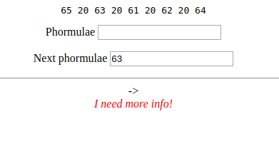
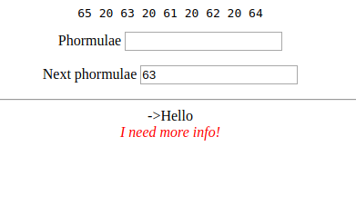
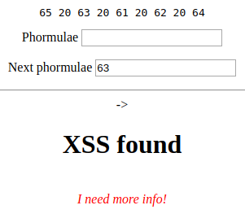
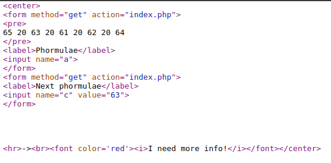

# LEVEL0 - ASTRAL

## Introduction

Let's start with first OverDrive CTF Web Hacking Challenge.

First of all, I'm quite noob on all of the Hacking Techniques but I think that one of the best ways to improve my skills is doing this types of challenges and also publishing them here.

So you can comment on any questions about the resolution of the challenge or any suggestion of challenges or recommendations to improve my skills

Anywey, let's start!

## Start

Okey, so the only thing that we have is a URL: [http://94.140.114.24:8080/level0/](http://94.140.114.24:8080/level0/)

This URL takes us to a form like this:

As we can see, we have two text fields: Phormulae and Next Phormulae.

Let's try putting Hello on Phormulae and press Enter.

So the form will print whatever we put on the text field.

Okey so I'm gonna try if it could have a XSS vulnerability.

##### XSS(Cross-Site-Scripting) is a type of a vulnerability that allows the injection of code on the client-site of a web application

To try this I can put something as simple as `<h1>XSS found</h1>`

If the web takes directly whatever you writes and don't check if it's a normal text, it will show "XSS found" as a HTML header (With bigger letters basically).

There it is!

This is a REALLY BIG PROBLEM (not for me :) ) because with something like this, you can put something like ``  

##### BTW! The form that we use to prove if it was vulnerable to XSS is the simplest way, and easily avoidable. BUT! There are more ways to prove that a web has a XSS Vulnerability (If the way that I used doesn't works, it doesn't mean that it's not vulnerable to XSS). But this is the level 0 and this way it's enough.

Before moving on, let's look the source code of the HTML:

As I mentioned before, the web takes all we insert on the form and put it directly on html code.

