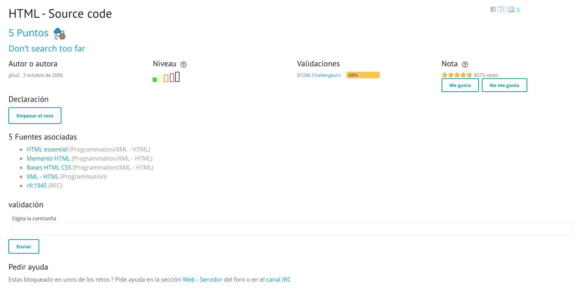
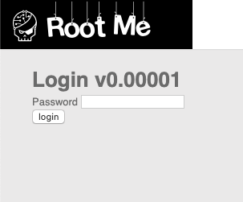

# HTML - SOURCE CODE

## Introduction

This is the first level of the web server challenges, so it will be a easy one.

Fortunately, this site always give you 1 or 2 clues to know how to start the challenge. 

First one is the name of the challenge that will give you a clue of what technique you have to use or what vulnerability you have to exploit. In this we know it will go from html, and that looking in the source code we will find something.

Second one its the clue that say **Don't search too far** that it say to us that we don't have to use any hard technique, it will be quite superficial (Obviously it's the easiest level)

Here you have a screenshot of the level info: 


## Getting Started

When we go to the challenge, the only thing that we have is a form of a Password like this:


And whatever that we try (1234, admin, blank password, etc.) will return a message that says **Incorrect password**

So, first of all we gonna see the source code of the site (Because the title of the challenge give us the clue that maybe we can find something on the source code). Let's see what we find:

```html

<html><body><link rel='stylesheet' property='stylesheet' id='s' type='text/css' href='/template/s.css' media='all' /><iframe id='iframe' src='https://www.root-me.org/?page=externe_header'></iframe>

<!--

Bienvenue sur ce portail,
Welcome on this portal,

J'espère que vous passerez un agréable moment parmi nous, mais surtout que vous repartirez plein de choses dans la tête...
I hope that you will enjoy your time among us, and above that all you will leave with lots of things in the head ...

@ très bientôt
See ya

-->
<h1>Login v0.00001</h1>

<form>
    Password&nbsp;<input type="password" value="" name="password"/><br/>
    <input type="submit" value="login" />
</form><h4>Mot de passe incorrect / Incorrect password</h4>


<!--
                                                                                                                                                                                                                Je crois que c'est vraiment trop simple là ! 
                                                                                                                                                                                                                It's really too easy !
                                                                                                                                                                                                                password : nZ^&@q5&sjJHev0

-->

</body></html>
```

As we can see this level it's really easy and we can find directly the password on the source code as a comment. Here we have: **password: nZ^&@q5&sjJHev0**

Now, he can put this password on the form and we have this:


So we can validate the challenge to win the points introducing this password that we found.


And that's all! Obviously this is a really easy level ], we gonna increase the difficult as we level up.

### SEE YOU!
